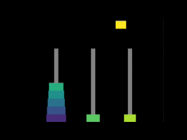

# Towers of Hanoi — Animated Solver in Rust

An animated, iterative solver for the classic [Towers of Hanoi](https://en.wikipedia.org/wiki/Tower_of_Hanoi) puzzle, built with Rust and the [Macroquad](https://macroquad.rs/) game framework.

The solver runs continuously, alternating between moving the discs forward (left → right) and backward (right → left), so you can watch the solution loop indefinitely.



---

## Features

- **Iterative solver** — the classic recursive algorithm is rewritten as a Rust `Iterator`, yielding one move at a time without recursion.
- **Smooth animation** — each disc travels along a three-segment path (up → across → down) with smoothstep easing.
- **Viridis color scale** — discs are colored using the perceptually uniform [Viridis](https://bids.github.io/colormap/) palette, with larger discs rendered in warmer tones.
- **Resolution-independent rendering** — the scene uses a fixed virtual coordinate space; the camera adapts automatically to any window size or aspect ratio.
- **Configurable disc count** — change a single constant to run the simulation with any number of discs (see below).

---

## Getting Started

### Prerequisites

- [Rust](https://www.rust-lang.org/tools/install) (stable toolchain, edition 2021 or later)

### Build & Run

```bash
git clone https://github.com/your-username/towers-of-hanoi.git
cd towers-of-hanoi
cargo run --release
```

---

## Configuration

### Number of Discs

Open `src/dimensions.rs` and change the `NUM_OF_SLICES` constant:

```rust
/// The number of slices we use for the tower simulator.
pub const NUM_OF_SLICES: u8 = 8;
```

Any positive integer works. Keep in mind that the number of moves grows as **2ⁿ − 1**, so larger values will take noticeably longer to complete one full pass:

| Discs | Moves |
|------:|------:|
| 4 | 15 |
| 8 | 255 |
| 12 | 4 095 |
| 16 | 65 535 |

---

## Project Structure

```
src/
├── main.rs            # Entry point, main loop, TowerIterator
├── tower.rs           # Logical tower state and move commands
├── tower_graphics.rs  # Rendering: pillars, discs, camera
├── animation.rs       # Per-move animation along a path
└── dimensions.rs      # NUM_OF_SLICES and disc sizing/coloring
```

### Key Design Decisions

**`TowerIterator`** implements `Iterator<Item = TowerStateMove>` and `ExactSizeIterator`. Each call to `next()` applies one step of the [iterative Frame–Stewart algorithm](https://en.wikipedia.org/wiki/Tower_of_Hanoi#Iterative_solution) and yields the intermediate tower state together with the move command — cleanly separating logic from rendering.

**`AnimatingStone`** breaks each move into three `MovementSegment`s (lift, travel, lower) and uses `scan` to accumulate cumulative path lengths. During rendering it uses `find_map` over the segments to locate the correct position for the current frame.

---

## Dependencies

| Crate | Purpose |
|-------|---------|
| [`macroquad`](https://crates.io/crates/macroquad) | Rendering, window management, input |
| [`colorous`](https://crates.io/crates/colorous) | Viridis color scale for disc coloring |

---

## License

MIT — see [LICENSE](LICENSE) for details.
